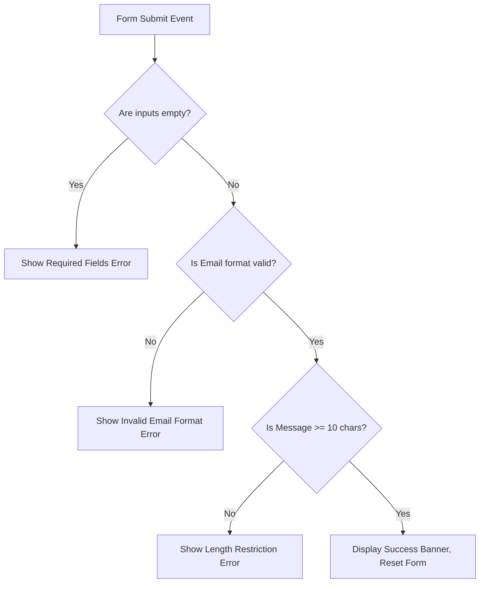

# Interactive Personal Portfolio Website - Week 3

## Project Overview
This project is the Week 3 final iteration of the Personal Portfolio Website developed during the Web Development Internship. Building upon the HTML5 foundation (Week 1) and CSS3 styles (Week 2), this version introduces dynamic client-side interactivity using vanilla JavaScript (`script.js`). The objective is to enhance the user experience (UX) through real-time feedback, personalized states, and responsive actions without relying on external libraries or frameworks. This iteration has been customized for Nitish Kumar Das.

---

## 🛠️ Technologies Used
- **HTML5:** Semantic document structure (`<header>`, `<nav>`, `<main>`, `<section>`, `<footer>`).
- **CSS3:** Responsive layout using Flexbox, CSS custom properties (variables), transitions, and media queries.
- **JavaScript (ES6+):** Vanilla DOM manipulation, event listeners, localStorage API, state management, and real-time input validation.
- **Google Fonts:** `Inter` font family for modern typography.

---

## 📂 Code Structure & File Hierarchy
```text
PortfolioWebsite/
│
├── index.html        # Core structure containing structure and form layouts
├── style.css         # Component styling, animations, and dark-mode variables
├── script.js         # Interactive logic, validation algorithms, and theme states
├── README.md         # Documentation, implementation details, and test evidence
│
├── images/
│   └── profile.jpg   # Profile picture asset
│
└── screenshots/      # Folder containing evidence of design layouts
```

---

## ⚡ JavaScript Features & Interactive Elements

The website integrates four major interactive elements that demonstrate advanced DOM manipulation, event capturing, and browser API integration:

### 1. Dynamic Local-Time Greeting
- **Description:** A customized message displays at the top of the header depending on the visitor's local system time (e.g., "Good morning! 🌅", "Good afternoon! ☀️", or "Good evening! 🌌").
- **Implementation:** The code uses `new Date().getHours()` to dynamically calculate the time, creates a new `<p>` element, injects the greeting, and inserts it into the DOM.

### 2. Dark/Light Theme Switcher (Persistent)
- **Description:** Users can toggle between standard light mode and a high-contrast dark mode using the theme button in the navigation bar.
- **Persistence:** The theme state is stored in the browser's `localStorage`. When the user refreshes the page or visits it later, their preferred theme is loaded instantly.
- **Implementation:** Handles classes dynamically via `document.body.classList.toggle('dark-mode')` and reads/writes preferences using `localStorage.getItem` and `localStorage.setItem`.

### 3. Read More (Show/Hide) Content Toggler
- **Description:** Collapses secondary biography details under the "About Me" section to keep the page clean and concise initially.
- **Implementation:** Listens to clicks on a `#read-more-btn`. It toggles a `.hidden` utility class (`display: none !important`) on the collapsible content div and updates the button label between "Read More" and "Read Less".

### 4. Advanced Client-Side Form Validation
- **Description:** The contact form prevents invalid data submissions by validating input entries before form action processing.
- **Error Feedback:** Displays specific error messages under the respective fields and outlines text borders in red.
- **Real-Time Auditing:** Validates inputs dynamically (on the `input` event) so validation indicators disappear instantly when corrections are made.

### 5. Typewriter Effect
- **Description:** An animated, self-typing role displayer in the hero header.
- **Implementation:** Cycles through multiple technical roles dynamically, typing and deleting characters with blinking cursor animations.

### 6. Back-to-Top Navigation Button
- **Description:** Floating button in the bottom right corner of the page.
- **Implementation:** Appears only when scrolling down past 300px, enabling the user to smoothly scroll back to the header with a single click.

---

## ⚙️ Technical Details & Validation Logic

### Form Validation Logic Diagram


### Key Validation Methods:
- **Email Regex:** Matches string input against `/^[^\s@]+@[^\s@]+\.[^\s@]+$/` to ensure it conforms to email formatting rules.
- **Length Constraint:** Validates `message.trim().length >= 10` to block short, spammy messages.
- **Success Handling:** Blocks default request submission using `event.preventDefault()`, resets form values, displays an animated success banner, and uses `setTimeout()` to fade it out after 4 seconds.

---

## 🧪 Testing Evidence & Test Cases

The application was tested against various user actions to ensure robust error handling and stability:

| Test Case ID | Feature Tested | Input Given | Expected Result | Actual Result | Status |
| :--- | :--- | :--- | :--- | :--- | :--- |
| **TC01** | Theme Persistent | Click Toggle Theme -> Refresh Page | Body retains `dark-mode` class, button text stays "☀️ Light Mode". | Passed exactly as expected. | **PASS** |
| **TC02** | Show/Hide About | Click "Read More" -> Click "Read Less" | Text expands and collapses smoothly; button labels flip state. | Passed exactly as expected. | **PASS** |
| **TC03** | Empty Form Submit | Submit with empty fields | Prevents submit, name input outlines in red, shows "Name is required." | Prevented submit, error shown. | **PASS** |
| **TC04** | Invalid Email | Input: `nitishkumar.com` | Real-time trigger outlines field in red, shows "Please enter a valid email." | Errors shown dynamically. | **PASS** |
| **TC05** | Short Message | Name & Email valid; Message: `Hi there` | Submitting flags the message field: "Must be at least 10 characters." | Validation triggered correctly. | **PASS** |
| **TC06** | Successful Submit | Valid Name, Valid Email, Valid Msg | Displays "Thank you! Your message has been sent successfully." Fades in 4s. | Successfully cleared and shown. | **PASS** |

---

## 🚀 Setup Instructions
1. Download or clone this directory.
2. Ensure the structure maps to the hierarchy in the *Code Structure* section.
3. Open `index.html` in any web browser.
4. Open the Developer Tools console (`F12`) to verify the message `"JavaScript Loaded and Ready!"` is logged upon page load.

---

## 👩‍💻 Author Information
**Name:** Nitish Kumar Das  
**Role:** B.Tech Student at IIT Jodhpur  
**Interests:** Artificial Intelligence, Embedded Systems, Internet of Things, Web Development
